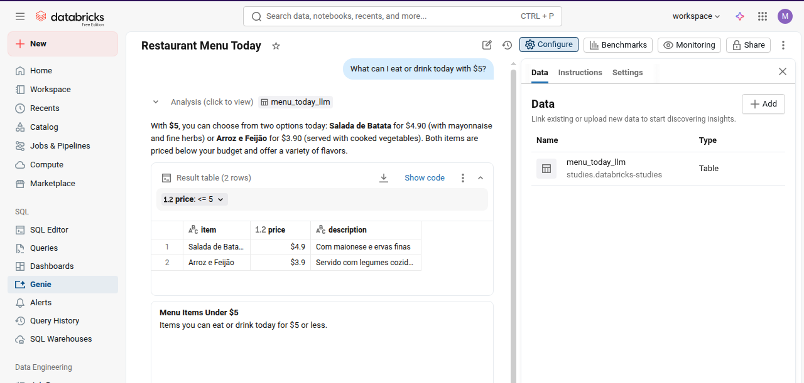

## AI Agent Fundamentals

###  Course description

>This foundational course introduces AI agents and their use in enterprise applications on Databricks, including the Mosaic AI platform and Agent Bricks. Learners will examine what AI agents are, how they function, and how they mimic human reasoning to handle complex tasks.

>The course covers real-world agent use cases and provides a basic introduction to advanced topics such as agentic workflows and multi-agent systems. It also explores how Agent Bricks simplifies the development of enterprise-ready agents across various applications, with demos showing how to build and use agents on Databricks.

### Application

To practice what we learned in the course, we created a simple agent that can answer questions about a menu given as input.

After extracting and structuring the information present in an image of today's menu (using Tesseract OCR and another version with a multimodal model), we connected the Databricks Genie agent to answer questions about today's menu.

- [See the Jupyter notebook codes](ai_agent_fundamentals.ipynb)
