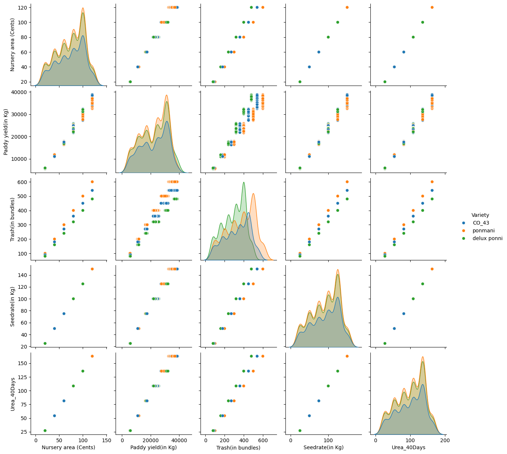

## Data Preparation for Machine Learning

### Course overview

> This course focuses on the fundamentals of preparing data for machine learning using Databricks. Participants will learn essential skills for exploring, cleaning, and organizing data tailored for traditional machine learning applications. Key topics include data visualization, feature engineering, and optimal feature storage strategies. Through practical exercises, participants will gain hands-on experience in efficiently preparing data sets for machine learning within the Databricks. This course is designed for associate-level data scientists and machine learning practitioners and individuals seeking to enhance their proficiency in data preparation, ensuring a solid foundation for successful machine learning model deployment.

- https://customer-academy.databricks.com/learn/course/2343/data-preparation-for-machine-learning?hash=819961100fd4840036ef52dd36d197b176689227&generated_by=1410453

 

 

### Codes

- [01. data_prep.ipynb](./01.%20data_prep.ipynb)
- [02. feature_engineer_pipeline.ipynb](./02.%20feature_engineer_pipeline.ipynb)
- [03. feature_store.ipynb](./03.%20feature_store.ipynb)
