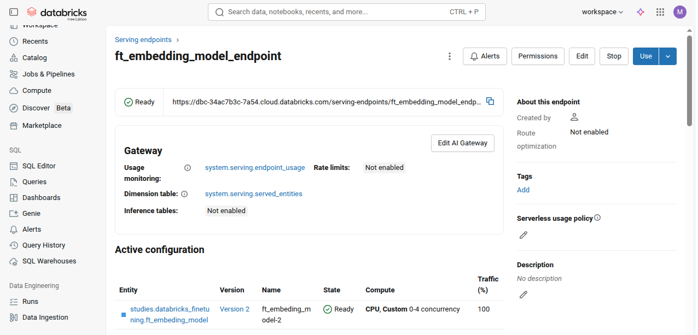

## Fine-tuning Embeddings and Advanced Retrieval

### Course overview

> This course offers a deep dive into understanding how embedding models affect retrieval performance with a focus on RAG (retrieval-augmented generation) applications. We will begin with a quick review of embeddings and then explore the motivations behind fine-tuning embedding models. We will cover key criteria for how to select an embedding model, how to prepare data for fine-tuning, and best practices for fine-tuning. We will discuss evaluation of embedding models, both during fine-tuning and during retrieval. Finally we will explore how to deploy a fine-tuned embedding model using Mosaic AI Model Serving and Vector Search.

- https://customer-academy.databricks.com/learn/course/2479/fine-tuning-embeddings-and-advanced-retrieval?hash=ff7304b62f08fe04bf70123128004aa34d534526&generated_by=1410453

### Codes

- [create_vector_search_endpoint](./create_vector_search_endpoint.ipynb)
- [data_prep_and_evaluation](./data_prep_and_evaluation.ipynb)
- [fine_tuning](./fine_tuning.ipynb)
