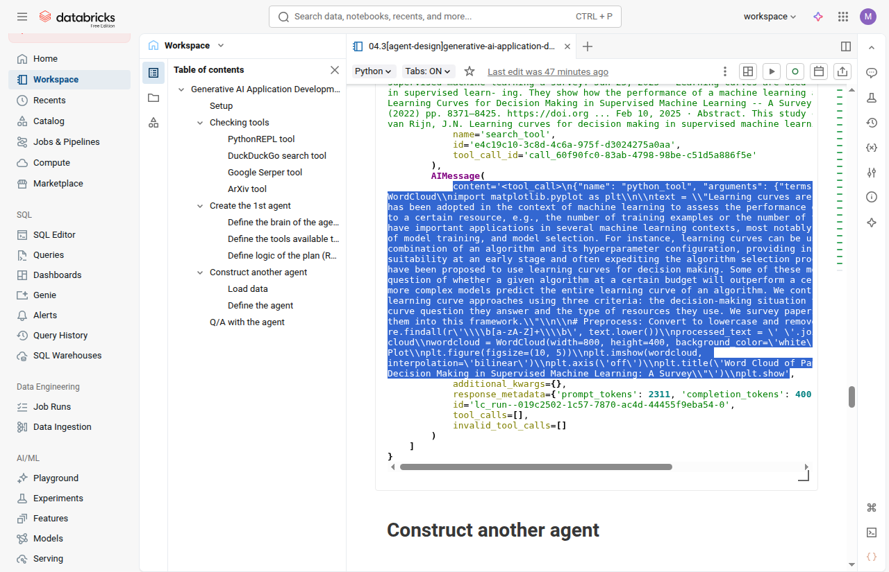

## AI Agent Fundamentals

###  Course description

>This course introduces contextual generative AI solutions using the retrieval-augmented generation (RAG) method. First, you’ll be introduced to RAG architecture and the significance of contextual information using Mosaic AI Playground. Next, we’ll show you how to prepare data for generative AI solutions and connect this process with building an RAG architecture. Finally, you’ll explore concepts related to context, embedding vectors, vector databases, and the utilization of Mosaic AI Vector Search.

- https://customer-academy.databricks.com/learn/courses/2716/generative-ai-application-development/lessons?generated_by=1410453&hash=d667dec43e3f900bc28cfc7145ee329ef573b07b

### Experiments with LangChain, tools, agents and LLMs

To test the concepts presented in the course and take advantage of the Databricks infrastructure made available to students, we created an agent that integrates a tool for a given task. This task included setting up the environment, choosing a dataset of interest to us (evaluating paper reviews), ingesting the data, creating a base for vector search index, including embedding tasks, chunking, dimensionality compatibility and practical semantic search tests on the created vector index table.

- **Jupyter notebooks:**
     - [prepare-data](./Generative%20AI%20Application%20Development/01[prepare-data]generative-ai-application-development.ipynb)
     -  [build-chains](./Generative%20AI%20Application%20Development/02[build-chains]generative-ai-application-development.ipynb)
     -  [agent-desing](./Generative%20AI%20Application%20Development/03[agent-design]generative-ai-application-development.ipynb)
