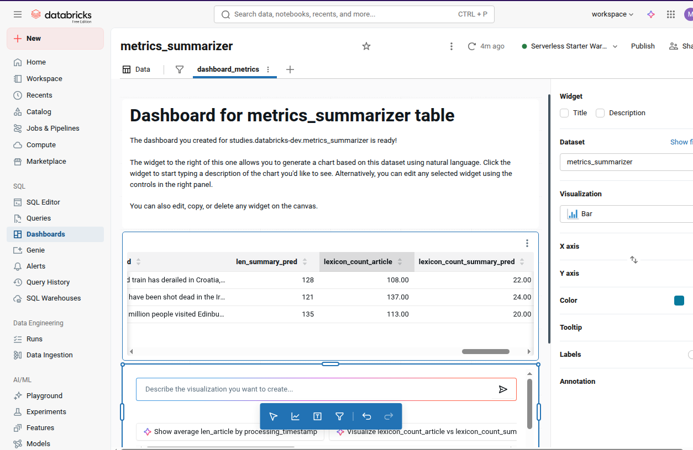

## AI Agent Fundamentals

### Course description

> After consuming the content inside of this learning pathway, you should be able to deploy, operationalize, and monitor generative deploying, operationalizing, and monitoring generative AI applications. This content will help you gain skills in the deployment of generative AI applications using tools like Model Serving. We’ll also cover how to operationalize generative AI applications following best practices and recommended architectures. Finally, we’ll discuss the idea of monitoring generative AI applications and their components using Lakehouse Monitoring.

- https://customer-academy.databricks.com/learn/course/2713/generative-ai-application-deployment-and-monitoring?hash=e2f6d8bbe4ba371cdb22860cf104d0ee92c5fab2&generated_by=1410453

### Experiments

To tests the concepts studied in the course, was developed codes to implement some tasks such as:

- Prepare dataset for a summarization task

- Create a pipeline with HuggingFace for summarization
  - Use model registry and versioned models with MLFlow
- Perform batch inference with different approaches: single-node, multi-node, SQL/`ai_query`()

- Load a model previously created to perform text summarization

- Create a Databricks endpoint to serve the model

- Run inference and compute some metrics in near real time

- Configure real-time performance monitoring in Databricks

### Jupyter notebooks:

   - [batch-inference](./batch-inference.ipynb)
   - [real-time-inference](./real-time-inference.ipynb)