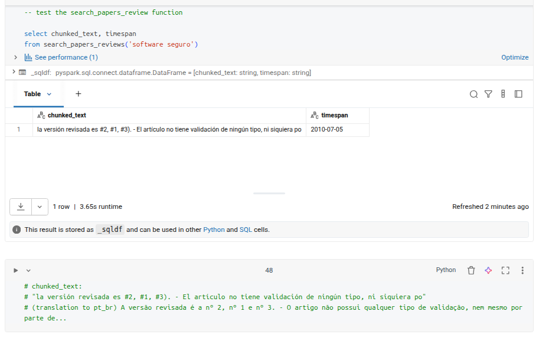
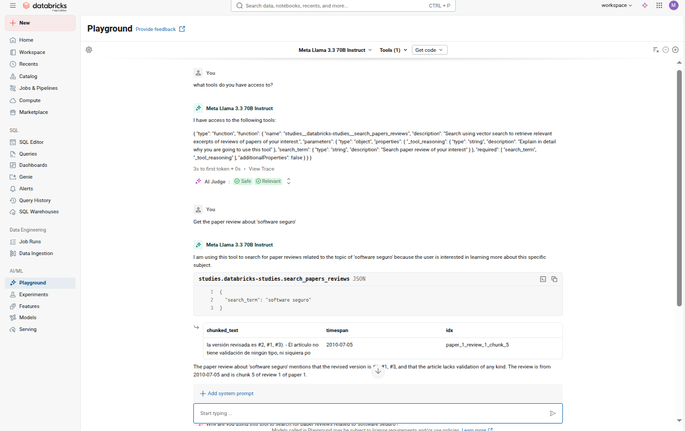

## AI Agent Fundamentals

###  Course description

>This course is an introduction to AI agents, their role in modern AI applications, and how to build AI agent applications on the Databricks platform. You'll learn about the principles of AI agents, how they differ from traditional AI systems, and explore their key components. Through interactive demos and hands-on labs, you'll see how to build, deploy, and evaluate AI agents on Databricks using Mosaic AI and Agent Bricks. By the end of this course, you'll understand how to create and deploy AI agents using the Databricks Data Intelligence Platform.

### Application

To test the concepts presented in the course and take advantage of the Databricks infrastructure made available to students, we created an agent that integrates a tool for a given task. This task included setting up the environment, choosing a dataset of interest to us (evaluating paper reviews), ingesting the data, creating a base for vector search index, including embedding tasks, chunking, dimensionality compatibility and practical semantic search tests on the created vector index table. Experiment codes:

- [Jupyter notebook](get_started_with_ai_agents.ipynb)
