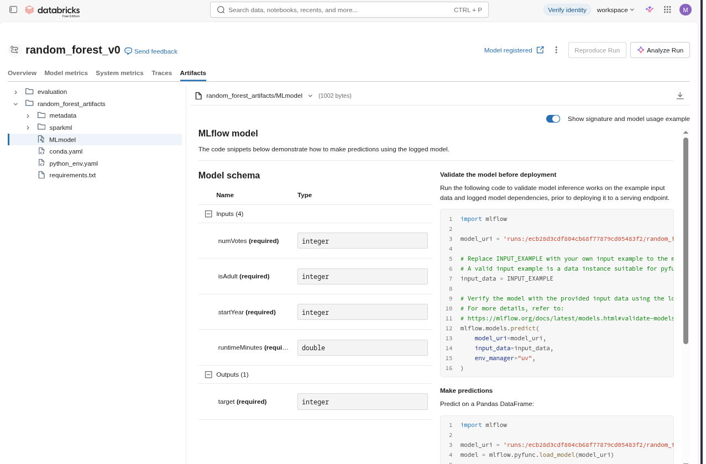

## Machine Learning Model Deployment

### Course objectives

>This course is designed to introduce three primary machine learning deployment strategies and illustrate the implementation of each strategy on Databricks. Following an exploration of the fundamentals of model deployment, the course delves into batch inference, offering hands-on demonstrations and labs for utilizing a model in batch inference scenarios, along with considerations for performance optimization. The second part of the course comprehensively covers pipeline deployment, while the final segment focuses on real-time deployment. Participants will engage in hands-on demonstrations and labs, deploying models with Model Serving and utilizing the serving endpoint for real-time inference.

- https://customer-academy.databricks.com/learn/courses/2395/machine-learning-model-deployment

### Experiments

We conducted experiments based on the content covered in the course, testing both on Databricks and locally and implementing machine learning models in practice. For this purpose, we used tools such as PySpark and MLflow, along with a sample of the [IMDB (Internet Movie Database) dataset]((https://developer.imdb.com/non-commercial-datasets/)), to predict whether a movie has an average rating greater than 8.0.

### Notebooks:

  - [01. classifier.ipynb](./01.%20classifier.ipynb)
  - [02. mlflow_classifier_imdb.ipynb](./02.%20mlflow_classifier_imdb.ipynb)
  - [03. mlflow_classifier_inference.ipynb](./03.%20mlflow_classifier_inference.ipynb)
  - [04. databricks_classifier_imdb.ipynb](./04.%20databricks_classifier_imdb.ipynb)
  - [05. databricks_classifier_eval.ipynb](./05.%20databricks_classifier_eval.ipynb)
