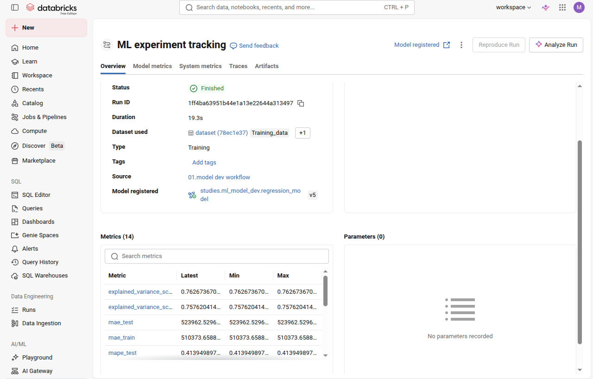

## Machine Learning Model Development

### Course learning objectives

>This comprehensive course provides a practical guide to developing traditional machine learning models on Databricks, emphasizing hands-on demonstrations and workflows using popular ML libraries. Participants will explore key ML techniques, including regression and clustering, while leveraging Databricks’ powerful capabilities. The course covers MLflow integration for model tracking, Databricks Feature Store for feature management, and Optuna for hyperparameter tuning. Additionally, participants will learn how to accelerate model training with Databricks AutoML. By the end of the course, learners will have real-world, practical skills to develop, optimize, and deploy machine learning models efficiently in the Databricks environment.

- https://customer-academy.databricks.com/learn/courses/2390/machine-learning-model-development?hash=bae25180b9ac14f0544e16806f87d43e21e422d6&generated_by=1410453

### Experiments

We conducted experiments with the content covered in the course, testing both in Databricks and locally, implementing machine learning models in practice. For this, we used tools such as PySpark and MLFlow, as well as models like UMAP. We included an intra-cluster analysis with LLM, graphs, and values ​​related to [a rental database in the city of São Paulo](https://www.kaggle.com/datasets/marcelobatalhah/discover-so-paulo-apartment-prices-insights?utm_source=chatgpt.com).

Which region is charging high or low prices per square meter? Which neighborhoods have the greatest similarity and discrepancy? What is the relationship between the value and standard of the most rented properties? These are some of the questions explored in the studies.

### Notebooks:

  - [01. model_dev_workflow.ipynb](./01.%20model_dev_workflow.ipynb)
  - [02. clustering_embeddings.ipynb](./02.%20clustering_embeddings.ipynb)

